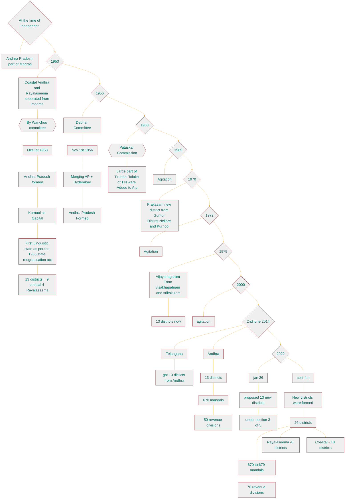
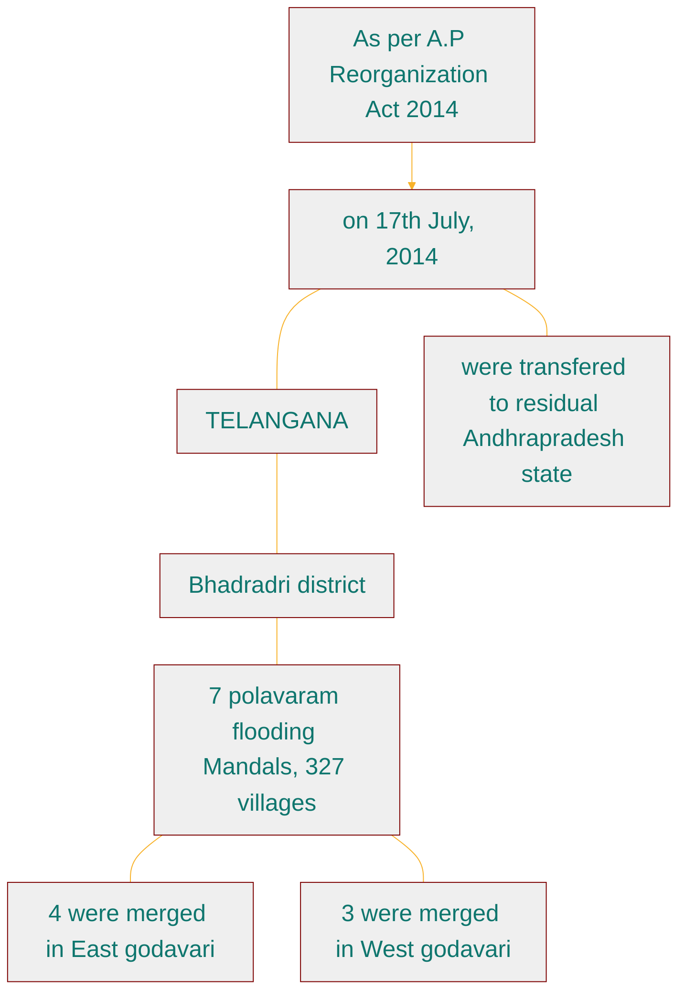

---
{"dg-publish":true,"permalink":"/ap-geogrpahy/01-ap-geography/","dg-note-properties":{"aliases":null,"THEA":"✔","THEA-URL":"https://www.thea.study/s/761704808/1e1e7fc48"}}
---

 
 
 

#space/ap-geography/01-intro

time line of andhra pradesh
?
-

<!--SR:!2026-05-07,1,130-->

	
- The total number of districts in the country - {{727}}
- The state having highest number of districts in the country - {{Uttar Pradesh-75}} whereas the state having least number of districts in the country - {{Goa}}.
- The average population of in each districts in the Andhra pradesh - {{19.7}}.
<!--SR:!2026-05-07,1,130!2026-05-07,1,130!2026-05-07,1,130!2026-04-22,1,130-->

- The law dealing with the powers of the state - AP distirct formation ACT, 1974
- The AP government had issued the official gazette notification for carving 13 new districts under the AP districts formation act 1974, section 3(5), on january 25, 2022.
- The final gazette regarding to new district was released by the government - april 03, 2022.
- The date newly formed districts came into force April 04, 2022.
- Total number of districts at present in the state - 26 (8 from rayalaseema + 18 from coastal Andhra).
- Total number of revenue divisions in Andhra Pradesh - {{76cue-tr taxes give revenue}}.
- Total number of Mandals - {{679}}.
<!--SR:!2026-05-08,2,170!2026-05-07,1,170-->

# state symbols

official language :: telugu
<!--SR:!2026-07-05,85,210-->

flower :: jasmine
<!--SR:!2026-06-01,26,170-->

emblem :: amaravati shcool of art , dharma chakra wheel of law triratnas.
<!--SR:!2026-05-10,4,170-->

2011 census how many districts, population and %of population:: 26 districts, 4.9 crore, 29.6% urban area.
<!--SR:!2026-05-08,2,150-->

population division :: 58.32 and 41.68
<!--SR:!2026-05-07,1,130-->

drougth :: 3rd largest drought prone area.
<!--SR:!2026-05-13,32,190-->

ports :: vishakapatnam and muthukur.
<!--SR:!2026-05-13,7,130-->

butter fly theme park :: kondapalli reserve.
<!--SR:!2026-05-10,4,170-->

sports :: kabadi
<!--SR:!2026-06-25,883,250-->

animal :: black buck
<!--SR:!2027-08-08,484,230-->

dance :: kuchipudi
<!--SR:!2028-02-19,679,230-->

tree :: neem margosa
<!--SR:!2026-06-07,57,190-->
.

bird :: rose ringed parmeet -- parrot.
<!--SR:!2026-06-13,63,193-->

Official song {{Ma telugu thalliki Mallepu dhanda}} declared as offcial song in {{1975}}
<!--SR:!2026-05-08,2,142!2026-05-10,4,170-->

state official acquatic animal {{Dolphin}}
<!--SR:!2026-07-19,74,258-->

state official news channel {{sapthagiri on sep 17 20144i}}
<!--SR:!2026-05-15,9,190-->

## physical features

- Andhra Pradesh State is situated in South east of India and extends between {{$12^{0}41^{'}-19^{0} 07^{'}$}}  North latitudes {{$76°50' - 84º.40'$}} east **cue-INHI IPOT-In Nepal Hukka Increased Indian Police Ordered Tracing** -longitudes with the {{lock key shape}}.
<!--SR:!2026-05-07,1,130!2026-05-08,2,150!2026-05-09,3,158--> 

  
- Amaravathi called as {{The peoples capital}}
- Andhra Pradesh is called as {{sun rise state}}
<!--SR:!2026-05-11,5,170!2026-05-10,4,170-->

## Capital 

- {{Amaravathi}} (The People's Capital) was declared as it's capital on {{23}}rd {{April}},  {{2015}} with the brand name of "Sun Rise State".
<!--SR:!2026-05-10,4,170!2026-05-08,2,150!2026-05-10,4,170!2026-05-07,1,130-->

- The foundation stone was laid on {{22 October 2015, }}at Uddandar ayunipalem village in Thulluru Mandal by the Prime Minister, Narendra Modi. The metropolitan area of Guntur and Vijayawada are the major conurbations of Amaravati.
<!--SR:!2026-05-07,1,130-->

- Amaravati is the de facto capital city of the Indian state of Andhra Pradesh.

- The planned city is located on the southern banks of the {{Krishna}} river in Guntur district, within the Andra Pradesh Capital Region, being built on a {{217}} sq km river front designed to have 51% of green spaces and 10% of water bodies. The word "Amaravati" derives from the historical Amaravathi Temple (Now it is in Palnadu district) town, the ancient capital of the Satavahana dynasty.
<!--SR:!2026-05-08,2,150!2026-05-08,2,150-->

* On December 30, 2014 CRDA (Capital region development authority) in Vijayawada was setup for the development of Capital city of Amaravathi.The total extent of the CRDA is 8,603.32 sq.km, within these the core capital extent is 217.23 sq.km. C.M acted as Chairman of CRDA.

- Andhra pradesh area position in India {{7th}}.
<!--SR:!2026-05-08,2,150-->

## Geographical extent :

- [x] create cue for the area in sqkm [priority::high] 🔺
<!--SR:!2026-05-20,14,213-->

- It's area is {{1,62,970}} sq.km, consisting {{4.87}}% in the total extent of the India and occupies {{8 changed to 7 after the JK bifurcation}}" position based on area in the country. (Source:AP economic survey 2023)**cue-7-T-tirumala**
<!--SR:!2026-05-08,2,150!2026-05-07,1,130!2026-05-10,4,170-->

- Note: But After the Bifurcation of J&K in 2 UT's AP stands {{7}}th position as per geographical area in the country)**cue-7-T-tirumala**.
<!--SR:!2026-05-08,2,150-->

### Largest Districts by Area (sq km)
?
> [! cue] PAY P - PAY through Phonepe
> - P - prakasam
> - A - Alluri sitaramaraj
> - Y - Ysr
> - Phonepe- pottisriramulu
1. Prakasam District (14,432)
2. Alluri Sitaramaraj (12,251)
3. YSR (11,228)
4. Potti Sriramulu Nellore (10,441)
<!--SR:!2026-05-07,1,130-->

### Smallest Districts by Area (sq km)
?
>[!cue] vawg - Violence Against Women and Girls
>- Violence - vishakapatnam
>- Against - Ambedkar
>- women-  west godavari
>- girls  - guntur
1. Visakhapatnam District (1,048)
2. Dr.B.R. AmbedkarKonaseema (2,083)
3. West Godavari District (2,178)
4. Guntur District (2,443)
<!--SR:!2026-05-07,1,130-->

  

  

## Population  

- As per 2011 census total population of the state is {{4.95}} crores (4.09%), occupies {{10}}" position in the total population of the country. Within these {{70.53}}% is rural population and {{29.47}}% is urban population.
<!--SR:!2026-05-08,2,150!2026-05-07,1,130!2026-05-17,11,190!2026-05-13,7,178-->

  

  

  

### Largest districts in terms of population (in lakhs)
?
>[! cue] PPKA - potti prakash king in acting
>- potti - potti sriramulu nellore
>- prakash -  prakasam
>- king - kurnool
>- acting - ananthapur
1. Potti Sriramulu Nellore (24,697)
2. Prakasham (22.88)
3. Kurnool (22.71)
4. Ananthapur (22.41)
<!--SR:!2026-05-07,1,130-->

### Smallest districts in terms of population (in lakhs)
?
>[! cue] pabd - Parvathi and sitaramaraju banging in ambedkar district
>- parvathi - parvathipuram
>- alluri - alluri sitaramaraj
>- banging - bapatla
>- ambedkar - Dr.Br.Ambedkar (konaseema)
1. Parvathipuram Manyam (9.253)
2. Alluri Sitaramaraj (9.53)
3. Bapatla (15.86)
4. Dr. Br.Ambedkar (17.19)
<!--SR:!2026-05-07,1,130-->

- Mandals: At present total number of Mandals in the state {{679}}**cue-679-RTP -Roja Terminated from Party**.
- [x] cue for madals [priority::high] 🔺
<!--SR:!2026-06-02,27,210-->

### Districts with highest mandals
?
> [! cue] ppyt - potti prakash yesterday terminated
> - Potti - sri potti sriramulu nellore
> - Prakash - prakasam
> - Yesterday - YSR
> - Terminated - Tirupati
1. Prakasam District & SriPotti Sriramulu Nellore (38)
2. YSR (36)
3. Tirupati (34)
<!--SR:!2026-05-07,1,150-->

### Districts with least mandals
?
>[! cue] visakha parvathi beautiful
>- visakha - visakhapatnam
>- parvathi - parvathipuram
1. Visakhapatnam District (11)
2. Parvathipuram Manyam (15)
<!--SR:!2026-05-08,2,150-->

### Population Density :

- As per 2011 census total population of the density is {{304}}, where as it is {{382}} in the country.**cue-304-moh-manushulu operating in House, 382-mbn-manushulu bathukuthunaru in national**
<!--SR:!2026-05-08,2,150!2026-05-08,2,150-->

### Highest density populated districts
?
>[! cue] very good
>- very - visakhapatnam
>- good - guntur
1. Visakhapatnam District (1870)
2. Guntur (856)
<!--SR:!2026-05-07,1,130-->

### Least density populated districts
?
> [! cue] andhra pradesh
> - andhra - alluri sitaramaraj
> - pradesh - prakasam
1. Alluri Sitaramaraj District (78)
2. Prakasam (160)
<!--SR:!2026-05-07,1,130-->

- Population Growth rate : As per the 2011 census population growth rate of the state is {{9.21}} as against the {{17.70}} of the national average.
<!--SR:!2026-05-08,2,150!2026-05-08,2,150-->

- Sex ratio: As per the 2011 census it is {{997}}, **cue- 997 ppr - 9 times a day sex is not good because 9 months delivery reduces to 7 months**. where as it is {{983}} in 2001 census. (The national average is 943).
<!--SR:!2026-05-08,2,150!2026-05-08,2,150-->

- Literacy rate: As per the 2011 census it is{{ 67.35}}%, **cue reading time (rt) 3 to 5** As against the national average of {{72.98}}**cue-7+2=9, before 9 is 8%
<!--SR:!2026-05-08,2,150!2026-05-08,2,150-->

- Urbanisation: Urbanisation has been regarded as an important component for growth realization. The percentage of urban population to the total population in the state is {{29.47}} percent in 2011 as compared to 24.13 percent in 2001.
<!--SR:!2026-05-08,2,150-->

  

  

 
- Total urbanised districts in AP, As per 2011- {{Vishaka patnam}} district
<!--SR:!2026-05-08,2,150-->

- Total rural districts in AP, As per 2011 - {{Alluri seetharama raju}} district
<!--SR:!2026-04-22,1,130-->

#### <strong style="color:#bf8040;">Number of Tribal districts in the state (2)</strong>
?
>[! cue] Andhra Pradesh
>- Andhra - Alluri seethramaraju
>- Pradesh - parvathi puram manyam
- Alluri seethramaraju,
- Parvathi puram manyam.
<!--SR:!2026-05-07,1,130-->

- The district having highest number of Assembly constituencies in AP- {{Potti sriramulu (8)}}
<!--SR:!2026-05-07,1,170-->

- The district having lowest number of Assembly constituencies in AP-{{Alluri seetharama raju (3)}}
<!--SR:!2026-05-11,5,210-->

- <strong style="color:#bf8040;">Total number of coastal districts in AP 12. which are given below</strong>
?
1. Srikakulam
2. Vijayanagaram
3. Vishaka
4. Anakapalli
5. Kakinada
6. Dr.B.R.Ambedkar
7. West godavari
8. Krishna
9. Bapatla
10. Prakasam
11. Nellore
12. Tirupathi
<!--SR:!2026-05-08,2,150-->

- The district having longest length of coastline in AP - {{Srikakulam}}
<!--SR:!2026-05-10,4,170-->

- The district having least length of coastline in AP - {{West Godavari}}**cue west is having good production in shrimp and it supports pawan kalyan so jagan gave least sea land**
<!--SR:!2026-05-07,1,130-->

- <strong style="color:#bf8040;">Total number of land locked districts in AP (3)</strong>
?
>[! cue]  youth entertainment group
>- youth - ysr
>- entertainment - east godavari
>- group - guntur
1. YSR
2. East godavari
3. Guntur
<!--SR:!2026-05-07,1,170-->

- <strong style="color:#bf8040;">The districts in the state having border with highest number of other districts</strong>
?
<!--SR:!2026-05-08,2,150-->

>[! cue] YEG youth entertainment group
>- youth - ysr
>- entertainment - east godavari
>- group - guntur
1. YSR (6) 
2. East godavari (5)
3. Guntur (4)

### The districts in AP having border with neighbouring states

State

Border districts

#### 1.Odisha (3)
?
>[! cue] SAP
- Srikakulam,
- Parvathipuram manyam,
- Alluri seetharama raju
<!--SR:!2026-05-07,1,130-->

#### 2. Chattisgarh (1)
?
>[! CUE] chattI - I is sixth letter, allurI - i sixth lettter.
- Alluri seetharama raju
<!--SR:!2026-05-07,1,130-->

#### 3. Telangana(7)
?
>[! cue]
>PN PN KEA
- Alluri seetharama raju,
- Eluru,
- NTR,
- Palnadu,
- Prakasam,
- Nandyala,
- Kurnool.
<!--SR:!2026-05-07,1,130-->

#### 4. Karnataka (5)
?
>[!cue] KASAC
- Kurnool,
- Ananthapuram,
- Sri satyasai,
- Annamaiah,
- Chittoor
<!--SR:!2026-04-22,1,130-->

#### 5.Tamilnadu (2)
?
- Chittoor,
- Thirupathi
<!--SR:!2026-05-08,2,170-->

  

  

### The districts in AP recognised with famous personalities from the state :
?
1. Prakasam - 1972 (It was formed in 1970, February 2nd)
2. Sri potti sriramulu - 2008
3. YSR Kadapa - 2010
4. Sri satyasai - 2022
5. Annamaiah - 2022
6. Alluri - 2022
7. Dr. B.R. Ambedkar - 2022
8. NIR - 2022
9. Balaji - 2022
<!--SR:!2026-05-08,2,150-->

- Above districts {{srikakulam}} has longest coast line where as {{West Godavari}} has least length of coast line.**cue srikakulam have no money so jagan gave large sea ⛵ land to earn profit**

- [ ] change the below meraid later
<!--SR:!2026-05-08,2,150!2026-05-16,10,190--> 

### Merged mandals East Godavari
?
1. Chinturu(present ASR)
2. Kunavaram (present ASR)
3. Vara Rama Chandra Puram
4) Bhadrachalam (Partially Merged)Regional division of the A.P
- >[!cue] **cue chinna kukka ramudini Bhadrak ga chusukuntundhi**
- 
<!--SR:!2026-05-07,1,130-->

### Merged mandals in West Godavari
?
1. Velairpadu (Present Eluru)
2. Kukunoor (present Eluru)
3. Burgampadu
<!--SR:!2026-05-11,5,210-->

# Regional division of the AP
- Navyandhra pradesh has been divided into 2 geographical regions, such as
?
- [[AP Geogrpahy/01.ap-GEOGRAPHY#Rayalaseema Region\|#Rayalaseema Region]]
- [[AP Geogrpahy/01.ap-GEOGRAPHY#Coastal Andhra region\|#Coastal Andhra region]]
<!--SR:!2026-05-08,2,158-->

## Rayalaseema Region :

- It has the total area of {{67,291}} km. It is well known region for droughts and economically most backward region. It consist of total {{8}} districts at present.
<!--SR:!2026-05-08,2,150!2026-05-10,4,170-->

## rayalaseema table
No.

Districts

Area

Population

Revenue

(Sq.km)

2011 census

Divisions

Ananthapuram

Sri Satyasai

Kurnool

Nandyala

YSR Kadapa

10,205

2241105

03

8,925

1840043

04

7,980

2271686

03

9.682

1781777

03

11,228

2060654

04

Revenue

Mandals

81

32

26

29

36

  

A.P Location & Physical Setting

A.D.V. Ramana Raju

Annamayya

Chittoor

7,954

6,855

1697308

1872951

03

04

Tirupathi

8.231

2196984

04

30

31

34

- The district having largest area in Rayalaseema region - {{YSR Kadapa.}}
<!--SR:!2026-05-11,5,210-->

- The district having largest population in Rayalaseema region - {{Kurnool}}**cue-easy it has muslims so obviously populated**
<!--SR:!2026-05-07,1,130-->

- The district having smallest area in Rayalaseema region - {{Chittoor}}.
<!--SR:!2026-05-07,1,130-->

- The district having smallest population in Rayalaseema region - {{Annammya}}
<!--SR:!2026-05-08,2,150-->

- The district having largest number of mandals in Rayalaseema region - {{YSR Kadapa}} and Distirct having least mandals in Rayalaseema region - {{Kurnool}}.
<!--SR:!2026-05-07,1,130!2026-05-07,1,130-->

- The only Rayalaseema district having coastline - {{Thirupathi}}
<!--SR:!2026-05-07,1,130-->

# Coastal Andhra region:

- Coastal region has the total area of {{95,470 sq.km}}
<!--SR:!2026-05-08,2,150-->

- It has the total area of {{95,470}} sq.km and drained by Godavari, Krishna & Penna rivers. Comparatively well developed region. than the Rayalaseema region. It consist of {{11}} districts which are located along with the Bay of Bengal coast line and remaining {{7}} other districts which are away from the Bay of Bengal together called as Coastal Andhra region.
<!--SR:!2026-05-08,2,150!2026-05-08,2,150!2026-05-07,1,130-->

## coastal table
- [ ] #task/geography  added
No. Districts

Area (Sq.km)

10.

11.

12.

13.

Srikakulam

Vijayanagaram

Vishakapatnam

Anakapaili

Kakinada

Dr. B.R.Ambedkar

East Godavari

West Godavari

Eluru

Krishna

NTR

Guntur

Bapatla

4,591

4.122

1,048

4,292

3,019

2,083

2,561

2,178

6,679

3,775

3,316

2,443

3,729

Population

Revenue Revenue

2011 census Divisions Mandals

2191437

03

30

1930811

27

1959544

11

1726998

24

2092374

21

1719093

22

1832332

19

1779935

19

2071647

28

1735079

25

2218591

20

2091075

18

1586918

25

  

  

Location & Physical Setting14.15.16.

Palnadu

Prakasham

SPS Nellore

7,298

140322

10,441

2041729

2288026

2469712

A.D.V. Ramana Raju

28

38

38

Tribal districts

17.

18.

Parvathipuram

3.659

Alluri sectharama raju 12,251

925340

953960

2

15

22

## coastal data Note

- The district having largest area in Coastal Andhra region - {{Prakasam}}
<!--SR:!2026-05-07,1,130-->

- The district having largest Population in Coastal Andhra region - {{SPSNellore}}
<!--SR:!2026-05-10,4,170-->

- The district having lowest area in Coastal Andhra region - {{Vishaka}}
<!--SR:!2026-05-08,2,150-->

- The district having lowest populated in Coastal Andhra region - {{Parvathi puram manyam}}
<!--SR:!2026-05-08,2,150-->

  
- <strong style="color:#bf8040;">The district in Coastal Andhra region having largest number of mandals</strong>
?
>[! cue] prakash anna potti vadu ayyipoyadu
- Prakasam followed by
- PottiSriramulu
<!--SR:!2026-05-07,1,130--> 

- The district having lowest mandals - {{Vishaka }}
<!--SR:!2026-05-06,1,130-->

  
 

## Emblem of Andhra Pradesh
- creator
- three thing about the emblem
- name written in how many languages
- armiger
- crest
- torse
- blazon
- motto
?

- <strong style="color:#bf8040;">Creator of State Emblem</strong>
	• <strong style="color: red;">Soorisetty Anjineyulu</strong>, a drawing master from Nellore is the creator of the emblem, which was selected out of 300 emblems that were submitted.
- <strong style="color:#bf8040;">Symbol of Andhra Pradesh</strong>
	- The emblem features are,
		- <mark style="background-color: #BAFFC9; color: black;">Purna Ghataka</mark> at the centre encircled
		- <mark style="background-color: #FFFFBA; color: black;">Dharmachakra</mark> symbolising the "wheel of law", portrayed from Amaravati school of arts,
		- Surrounded by the <mark style="background-color: #FFDFBA; color: black;">name of the state</mark> in Telugu, English and Hindi
- <strong style="color:#bf8040;">Armiger</strong>
	- The Government of Andhra Pradesh
- <strong style="color:#bf8040;">Crest</strong>
	- The National Emblem of India
- <strong style="color:#bf8040;">Torse</strong>
	- Dharma chakra
- <strong style="color:#bf8040;">Blazon</strong>
	- Purna Ghataka, Dharmachakra
- <strong style="color:#bf8040;">Motto</strong>
	- Satyameva Jayate, Sanskrit for "Truth Alone Triumphs
<!--SR:!2026-05-07,1,130-->

- Ap formation day was observed as {{November 1st from 2019}} on wards.
<!--SR:!2026-05-08,2,150-->